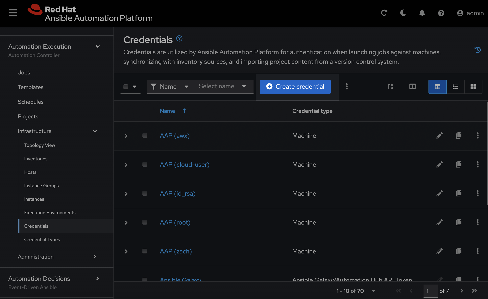
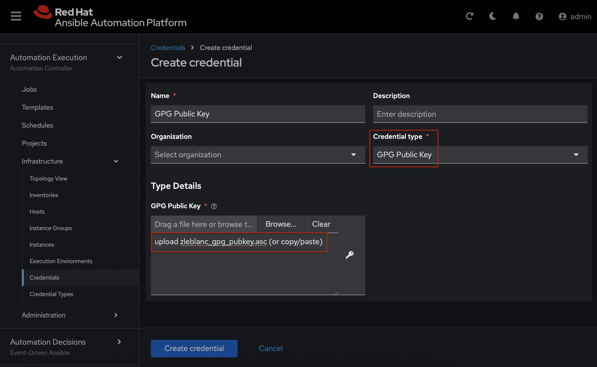
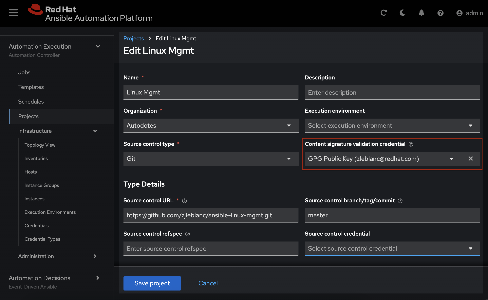

# ansible-sign (CLI)

The [ansible-sign](https://github.com/ansible/ansible-sign) tool makes it easy to sign and verify ansible content. This is a great way establish a trusted supply chain in your Ansible Automation Platform environment.

Check out my blog post -> 📝

## Generate Key-pair

### Generate
```bash
$ gpg --full-generate-key
# follow prompts, example below
# key type -> rsa
# size -> 2048

# REMEMBER the passkey for later!
```

### List
```bash
$ gpg --list-keys
[keyboxd]
---------
pub   ed25519 2025-04-11 [SC] [expires: 2028-04-10]
      66374269E2A30553270A87937ACBCA9097F987F3 # fingerprint
uid           [ultimate] Zachary LeBlanc <zleblanc@redhat.com>
sub   cv25519 2025-04-11 [E] [expires: 2028-04-10]
```

### Export Public Key
```bash
$ gpg --export --armour 66374269E2A30553270A87937ACBCA9097F987F3 > zleblanc_gpg_pubkey.asc
```


## Create a Manifest

The [MANIFEST.in](MANIFEST.in) file determines what content in the repository is signed. It is important to establish a comprehensive MANIFEST to inform ansible-sign what files to manage. Downstream, Ansible Automation Platform will be able to reference the resulting signature against the content it has before executing a job.

See details for using manifest key words [here](https://setuptools.pypa.io/en/latest/userguide/miscellaneous.html).

## Sign and verify

At the root of your project, adjacent to the MANIFEST file, run the following:<br>
`ansible-sign project gpg-sign .`
<br>
```
[OK   ] GPG signing successful!
[NOTE ] Checksum manifest: ./.ansible-sign/sha256sum.txt
[NOTE ] GPG summary: signature created
```

Two files will be created:
1. [checksums](.ansible-sign/sha256sum.txt)
2. [signature](.ansible-sign/sha256sum.txt.sig)

To confirm a successful signature, run the following:<br>
`ansible-sign project gpg-verify .`<br>
```
[OK   ] GPG signature verification succeeded.
[OK   ] Checksum validation succeeded.
```

## Configure Content Validation in Ansible Automation Platform

After completing these steps, Ansible Automation Platform will verify the signature before executing any jobs using content from the associated repository. The content validation occurs during Project Sync(s).

### Create New Credential



### Configure GPG Public Key Credential



### Attach Credential to Project



## Pre-commit Hook

I am not capable of remembering to use `ansible-sign` before I push commits to my repository, so I added the commands to my pre-commit hook. If you are unfamiliar with git hooks, then navigate to the `.git/hooks` folder at the root of your repository and poke around. Below is an example of what my pre-commit hook looks like for this implementation.

### .git/hooks/pre-commit

This file is not version-controlled, so it has a sensitive passphrase used to access the GPG private key for signing. There are other ways to inject this value into the environment, but this one works for me.

```bash
#!/usr/bin/env bash

# ansible-sign
export GPG_TTY=$(tty)
export ANSIBLE_SIGN_GPG_PASSPHRASE="s3cr3t" # think back to when you created the GPG keypair
ansible-sign project gpg-sign .
git add .ansible-sign/
ansible-sign project gpg-verify .

if [[ $? -eq 0 ]]; then
  unset GPG_TTY
  unset ANSIBLE_SIGN_GPG_PASSPHRASE
else
  unset GPG_TTY
  unset ANSIBLE_SIGN_GPG_PASSPHRASE
  exit 1
fi
```