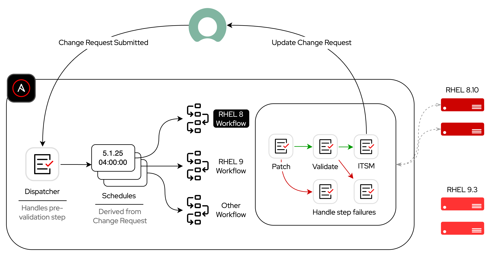

# Workload Dispatcher (Patching)

Mocked example using a Change Request to drive workload scheduling with Ansible Automation Platform.

## Demo Setup

- Use `AWS // Create VM` Job Template based on cloud-mgmt [playbook](https://github.com/zjleblanc/ansible-cloud-mgmt/blob/master/playbooks/aws/create_vm.yml) to provision 2 RHEL 8.10 instances and 2 RHEL 9.3 instances for demo purposes
- Launch `Linux // Patching // Dispatcher` Workflow with a time in the near future
- Observe sequence of events:
  - Pre-validation
  - Path determination
  - Schedule creation
  - Downstream workflow invocations based on Schedules
    - Main operation (patching)
    - Post-validation
    - ITSM reconciliation
    - _Error handling pathways_

## Ingress Data Model

```yaml
change_request: CHG01234
patch_targets:
  rhel8-vm-1:
    change_window_datetime: "2025-04-25 12:30:00"
    change_window_timezone: America/Chicago
  rhel8-vm-2:
    change_window_datetime: "2025-04-25 13:00:00"
    change_window_timezone: America/Chicago
  rhel9-vm-1:
    change_window_datetime: "2025-04-26 12:30:00"
    change_window_timezone: America/Chicago
  rhel9-vm-2:
    change_window_datetime: "2025-04-26 13:00:00"
    change_window_timezone: America/Chicago
```

## High-Level Diagram

